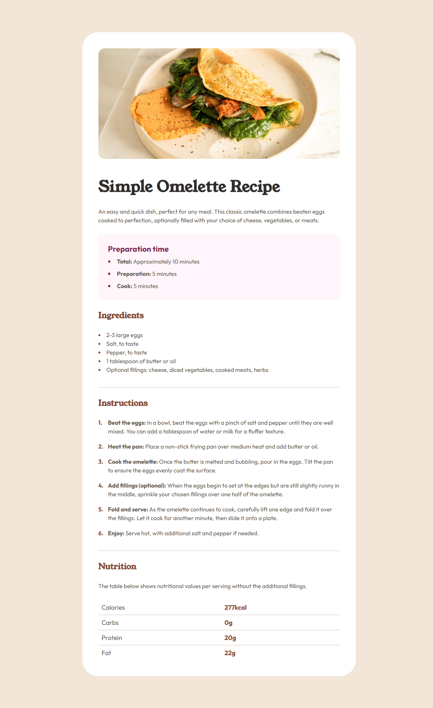
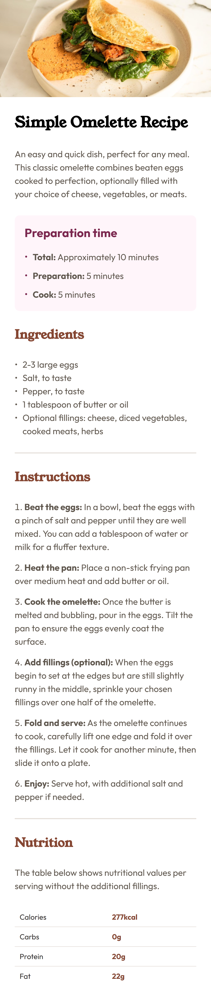

# 🍳 Recipe Page - Frontend Mentor Challenge

A beautiful, responsive recipe card showcasing a classic omelette recipe with modern web design principles and mobile-first approach.

## 📖 Table of Contents

- [Overview](#overview)
- [Screenshot](#screenshot)
- [Features](#features)
- [Technologies Used](#technologies-used)
- [Getting Started](#getting-started)

## 🎯 Overview

This project is a solution to the Recipe Page challenge from Frontend Mentor. The challenge was to build a responsive recipe card that looks great on both desktop and mobile devices.

### The Challenge

Users should be able to:

- View the recipe card on different screen sizes
- Read the recipe content clearly with proper visual hierarchy

## 📱 Screenshot

<a href="./screenshots/desktop.png">
    
</a>
<a href="./screenshots/mobile.png">
    
</a>

## ✨ Features

- **📱 Fully Responsive Design**: Seamless experience across all devices
- **🎨 Custom Typography**: Beautiful font pairings with Young Serif and Outfit
- **📊 Styled Data Tables**: Clean nutrition facts presentation

## 🛠️ Technologies Used

- **HTML5**: Semantic markup structure
- **CSS3**: Modern styling techniques including:
  - CSS Custom Properties (Variables)
  - Flexbox & Grid Layout
  - CSS Counters for custom numbering

## 🚀 Getting Started

### Prerequisites

- A modern web browser
- Basic understanding of HTML/CSS (optional)

### Installation

1. **Clone the repository**

2. **Navigate to project directory**

   `cd recipe-page-challenge`

3. **Open in browser**

   `open index.html`

## 💡 Code Highlights

### Custom CSS Counters for Recipe Steps

```
.instructions-list {
    list-style: none;
    counter-reset: step-counter;
}
```

## What I Learned

During this project, I gained valuable experience with:

- CSS Counters: Learning how to create custom numbered lists
- Table Styling: Mastering border-collapse and responsive design
- Typography Hierarchy: Implementing effective font pairings

**Key Insights**

1. order Collapse Mystery: Discovered why tr borders weren't working!
2. Custom List Markers: CSS counters provide more flexibility than default styling

## 📞 Connect With Me

- Frontend Mentor: [@muhaideennausar](https://www.frontendmentor.io/profile/muhaideennausar)
- GitHub: [@muhaideennausar](https://github.com/muhaideennausar)
- LinkedIn: [Muhaideen Nausar](www.linkedin.com/in/muhaideen-nausar-b87819376)

**Made with ❤️ and lots of ☕ in Chennai, Tamil Nadu**
